# Amazon Connect basic hours of operation with contact flow - CloudFormation

## Introduction

This folder provides templates to deploy an Amazon Connect instance with a sample Contact Flow that integrates with the created hours of operation and routes callers to an Amazon Connect User that is created as an Agent. We show how to deploy the first iteration of the Amazon Connect setup and then show how we can update the operating hours and contact flow using CloudFormation.

## Requirements to deploy the solution

- An AWS account to create the CloudFormation stack in.

    - In this account, ensure that the IAM principal deploying the CloudFormation template has the required permissions to create the resources in the stack.

## Cost of the solution

The resources created could incur costs in your AWS Account. Consider deleting the resources created once your tests are done. Some reference links to calculate the costs are as follows:

* For more information about Amazon Connect Pricing and Free Tier, please refer to the [Amazon Connect Pricing documentation](https://aws.amazon.com/connect/pricing/).
* AWS Lambda first 1 Million requests per month are covered by the [AWS Free tier](https://aws.amazon.com/free/?all-free-tier.sort-by=item.additionalFields.SortRank&all-free-tier.sort-order=asc).
* AWS Systems Manager Parameter Store Standard parameters and Standard Throughput have no additional charge. More info [here in the Parameter Store section](https://aws.amazon.com/systems-manager/pricing/).
* Cloudwatch Logs usage is covered by the free tier if you use less than 5GB of data. More info [here](https://aws.amazon.com/cloudwatch/pricing/).

## Deploying the first iteration of the Amazon Connect architecture

The [contact-center.yaml CloudFormation template](./contact-center.yaml) deploys the following architecture:

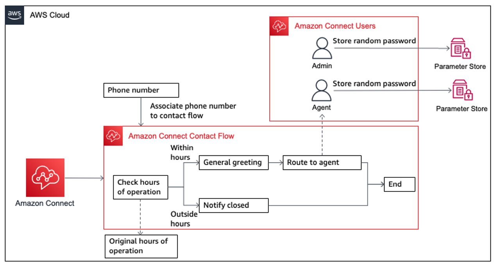

* Amazon Connect related resources

  * An Amazon Connect instance that contains the other Amazon Connect resources.
  * An Amazon Connect Hours of Operation that contains the operating hours used by the contact flow.
  * An Amazon Connect Contact Flow.
  * An Amazon Connect Phone Number from the `US`. This is associated with the Amazon Connect Contact Flow.
  * Two Amazon Connect Users with the `Agent` and `Admin` Security Profiles associated respectively.

* AWS Lambda functions

  * A Lambda function to retrieve the ARN of the `Basic Routing Profile` that comes with the Amazon Connect instance. This is associated with each Amazon Connect User.
  * A Lambda function to retrieve the ARN of the `Agent` and `Admin` Security Profiles that comes with the Amazon Connect instance. This is associated with each Amazon Connect User respectively.
  * A Lambda function to generate a random string that is used as the password for each Amazon Connect User. These passwords are stored as secure string parameters in AWS Systems Manager Parameter Store.
  * A Lambda function to associate the Amazon Connect Phone Number with the Amazon Connect Contact Flow.

* Systems Manager Parameter Store

  * Two Systems Manager parameters that stores the `Agent` and `Admin` passwords as secure string parameters.

### Deployment Steps

The template that deploys the first iteration of the Amazon Connect deployment can be found at [contact-center.yaml](./contact-center.yaml).

If you're using the AWS Console, follow the instructions at [AWS CloudFormation documentation: Creating a stack on the AWS CloudFormation console](https://docs.aws.amazon.com/AWSCloudFormation/latest/UserGuide/cfn-console-create-stack.html).

If you're using the AWS CLI, follow the instructions at [AWS CloudFormation documentation: Using the AWS Command Line Interface](https://docs.aws.amazon.com/AWSCloudFormation/latest/UserGuide/cfn-using-cli.html). For a sample command, run the following, replacing the parameters accordingly. You can also override additional parameters.

```bash
aws cloudformation deploy \
  --template-file ./contact-center.yaml \
  --stack-name amazon-connect-demo \
  --capabilities CAPABILITY_IAM
```

### Testing the first iteration

1. Retrieve the Admin credentials from Systems Manager Parameter Store. Choose `amazon-connect-temp-Admin-password`

    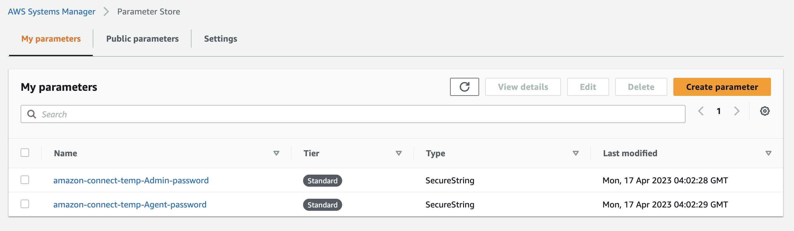

2. Choose `Show` and record the password to be used to log in to Amazon Connect.

    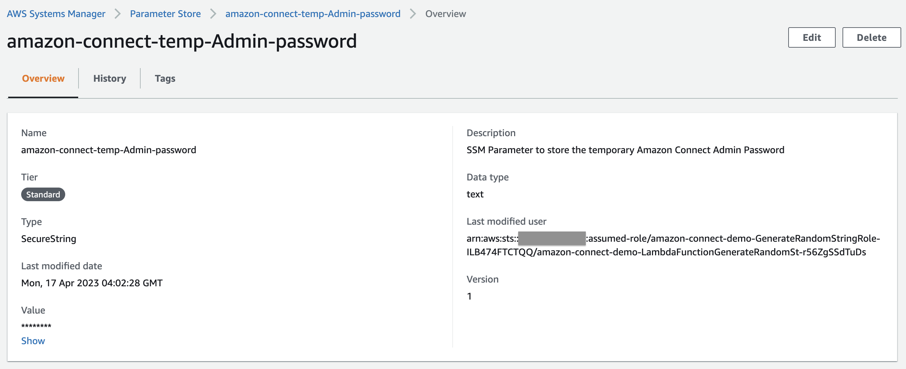

3. Navigate to the Amazon Connect console and select the URL under `Access URL`.

    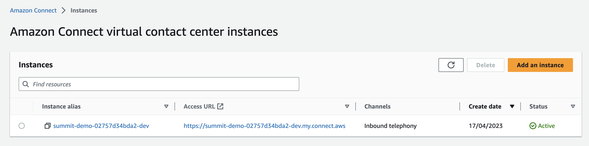

4. For `Username`, enter `adminuser` and for password, enter the password retrieved from Step 2.

    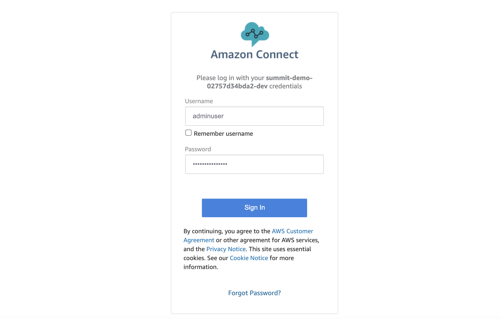

5. This opens up the Amazon Connect home page. Navigate to the Hours of operation page. The hours of operation page can also be found at `<your-access-url>/operating-hours`. Then choose `Office Hours`. View the original set of office hours.

    

6. Navigate to the Contact Flow page. The contact flow page can also be found at `<your-access-url>/contact-flows`. Then choose `AnyCompany Main Flow`. View the original contact flow.

    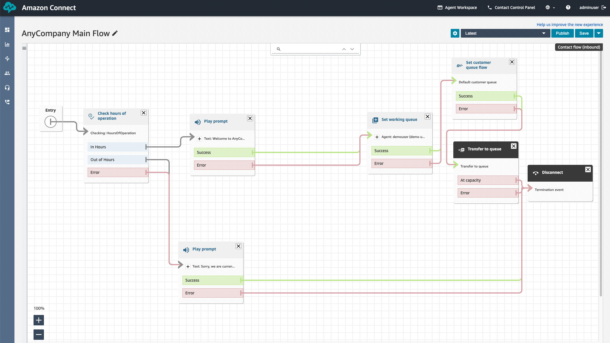

7. Navigate to the Manage phone numbers page. The Manage phone numbers page can also be found at `<your-access-url>/numbers`. You may dial this phone number to test the contact flow. Before testing, please refer to the [Amazon Connect Pricing documentation](https://aws.amazon.com/connect/pricing/) to understand any potential costs with dialing.

    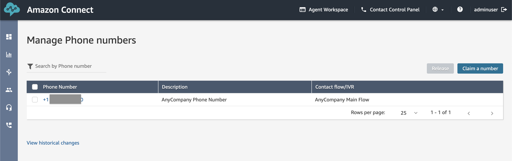

## Deploying the second iteration of the Amazon Connect architecture

The [contact-center-update.yaml CloudFormation template](./contact-center-update.yaml) deploys the same resources as the resources in the first iteration. The updates would be to existing resources, namely, the hours of operation resource and the contact flow resource. These are highlighted in the following architecture:

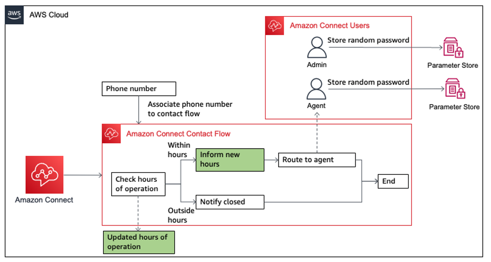

Code changes can be found by doing a diff:

1. Hours of operation change

  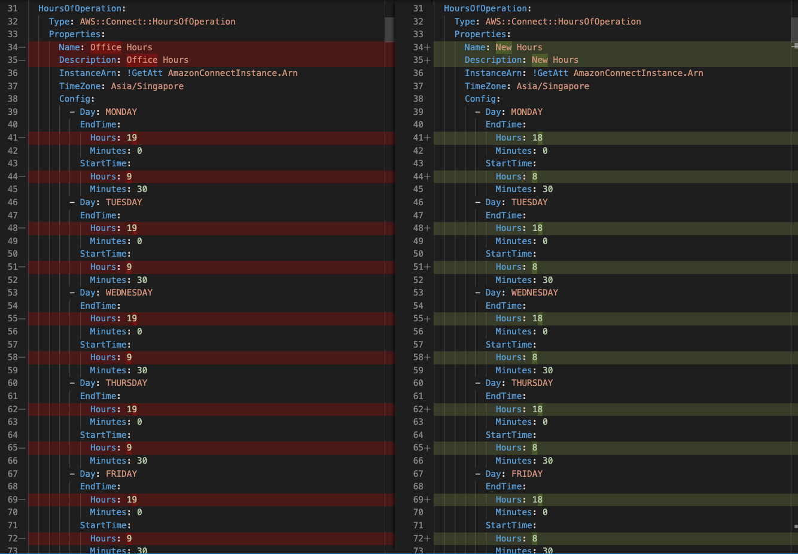

2. Snippet of a part of the Contact flow change

  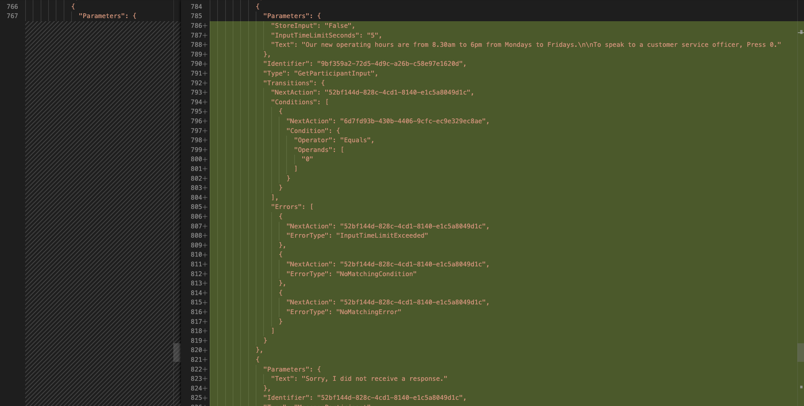

### Deployment Steps

The template that deploys the second iteration of the Amazon Connect deployment can be found at [contact-center-update.yaml](./contact-center-update.yaml).

If you're using the AWS Console, follow the instructions at [AWS CloudFormation documentation: Creating a stack on the AWS CloudFormation console](https://docs.aws.amazon.com/AWSCloudFormation/latest/UserGuide/cfn-console-create-stack.html).

If you're using the AWS CLI, follow the instructions at [AWS CloudFormation documentation: Using the AWS Command Line Interface](https://docs.aws.amazon.com/AWSCloudFormation/latest/UserGuide/cfn-using-cli.html). For a sample command, run the following, replacing the parameters accordingly. You can also override additional parameters.

```bash
aws cloudformation deploy \
  --template-file ./contact-center-update.yaml \
  --stack-name amazon-connect-demo \
  --capabilities CAPABILITY_IAM
```

### Testing the second iteration

1. Retrieve the Admin credentials from Systems Manager Parameter Store. Choose `amazon-connect-temp-Admin-password`

    

2. Choose `Show` and record the password to be used to log in to Amazon Connect.

    

3. Navigate to the Amazon Connect console and select the URL under `Access URL`.

    

4. For `Username`, enter `adminuser` and for password, enter the password retrieved from Step 2.

    

5. This opens up the Amazon Connect home page. Navigate to the Hours of operation page. The hours of operation page can also be found at `<your-access-url>/operating-hours`. Then choose `New Hours`. View the updated set of office hours.

    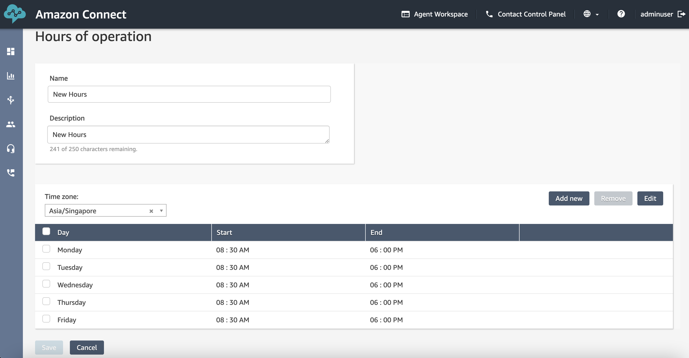

6. Navigate to the Contact Flow page. The contact flow page can also be found at `<your-access-url>/contact-flows`. Then choose `AnyCompany Main Flow`. View the original contact flow.

    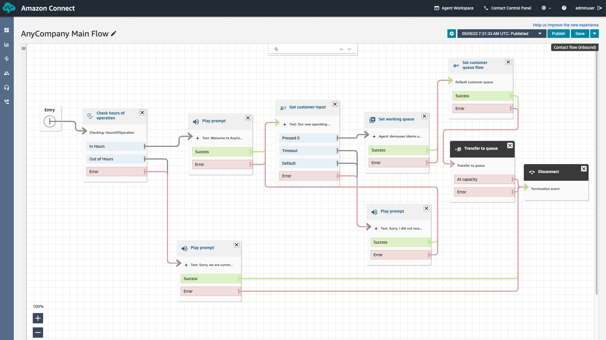

7. Navigate to the Manage phone numbers page. The Manage phone numbers page can also be found at `<your-access-url>/numbers`. You may dial this phone number to test the contact flow. Before testing, please refer to the [Amazon Connect Pricing documentation](https://aws.amazon.com/connect/pricing/) to understand any potential costs with dialing.

    

## Clean up

Once you're done, you can delete the solution by navigating to the [AWS CloudFormation console](https://console.aws.amazon.com/cloudformation/home?#/stacks/), selecting the stack and choosing `Delete`.

In addition, don't forget to delete the following artifacts too:

* Delete the Amazon CloudWatch Log Groups created by the Lambda Functions. They are named as follows: `/aws/lambda/<CloudFormation Stack Name>-<Lambda Function CloudFormation resource logical ID>-<random ID>`. For example, with the stack name as `amazon-connect-demo`, the CloudWatch Log groups are:

  * `/aws/lambda/amazon-connect-demo-LambdaFunctionGetRoutingProfil-1234567890ab`
  * `/aws/lambda/amazon-connect-demo-LambdaFunctionGetSecurityProfil-1234567890ab`
  * `/aws/lambda/amazon-connect-demo-LambdaFunctionGenerateRandomSt-1234567890ab`
  * `/aws/lambda/amazon-connect-demo-LambdaFunctionAssociatePhoneNu-1234567890ab`

## Security

See [CONTRIBUTING](../../../CONTRIBUTING.md#security-issue-notifications) for more information.

## License

This library is licensed under the MIT-0 License. See the LICENSE file.