# Amazon Connect instance storage config S3 - CloudFormation

## Introduction

This folder provides templates to deploy an Amazon Connect instance with a sample Contact Flow that integrates with the created hours of operation and routes callers to an Amazon Connect User that is created as an Agent. This architecture also includes an instance storage configuration to pipe chat transcripts to an Amazon Simple Storage Service (Amazon S3) Bucket.

## Requirements to deploy the solution

- An AWS account to create the CloudFormation stack in.

    - In this account, ensure that the IAM principal deploying the CloudFormation template has the required permissions to create the resources in the stack.

## Cost of the solution

The resources created could incur costs in your AWS Account. Consider deleting the resources created once your tests are done. Some reference links to calculate the costs are as follows:

* For more information about Amazon Connect Pricing and Free Tier, please refer to the [Amazon Connect Pricing documentation](https://aws.amazon.com/connect/pricing/).
* AWS Lambda first 1 Million requests per month are covered by the [AWS Free tier](https://aws.amazon.com/free/?all-free-tier.sort-by=item.additionalFields.SortRank&all-free-tier.sort-order=asc).
* AWS Systems Manager Parameter Store Standard parameters and Standard Throughput have no additional charge. More info [here in the Parameter Store section](https://aws.amazon.com/systems-manager/pricing/).
* Cloudwatch Logs usage is covered by the free tier if you use less than 5GB of data. More info [here](https://aws.amazon.com/cloudwatch/pricing/).
* For more information about Amazon S3 Pricing and Free Tier, please refer to the [Amazon S3 Pricing documentation](https://aws.amazon.com/s3/pricing/).
* For more information about Amazon Key Management Service Pricing and Free Tier, please refer to the [Amazon Key Management Service Pricing documentation](https://aws.amazon.com/kms/pricing/).

## Deploying the Amazon Connect architecture

The [contact-center.yaml CloudFormation template](./contact-center.yaml) deploys the following architecture:

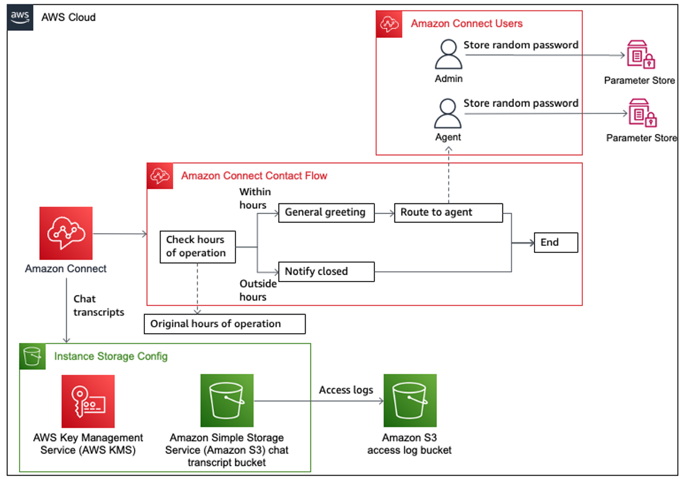

* Amazon Connect related resources

  * An Amazon Connect instance that contains the other Amazon Connect resources.
  * An Amazon Connect Hours of Operation that contains the operating hours used by the contact flow.
  * An Amazon Connect Contact Flow.
  * Two Amazon Connect Users with the `Agent` and `Admin` Security Profiles associated respectively.
  * An Amazon Connect Instance Storage Config that stores chat transcripts to an S3 bucket.

* AWS Key Management Service (AWS KMS)

  * An AWS KMS key used to encrypt the Amazon S3 bucket that stores chat transcripts.

* Amazon S3 buckets

  * Two Amazon S3 buckets. The first S3 bucket stores the chat transcripts. The second S3 bucket stores the access logs from the first S3 bucket.

* AWS Lambda functions

  * A Lambda function to retrieve the ARN of the `Basic Routing Profile` that comes with the Amazon Connect instance. This is associated with each Amazon Connect User.
  * A Lambda function to retrieve the ARN of the `Agent` and `Admin` Security Profiles that comes with the Amazon Connect instance. This is associated with each Amazon Connect User respectively.
  * A Lambda function to generate a random string that is used as the password for each Amazon Connect User. These passwords are stored as secure string parameters in AWS Systems Manager Parameter Store.
  * A Lambda function to associate the Amazon Connect Phone Number with the Amazon Connect Contact Flow.

* Systems Manager Parameter Store

  * Two Systems Manager parameters that stores the `Agent` and `Admin` passwords as secure string parameters.

### Deployment Steps

The template that deploys the first iteration of the Amazon Connect deployment can be found at [contact-center.yaml](./contact-center.yaml).

If you're using the AWS Console, follow the instructions at [AWS CloudFormation documentation: Creating a stack on the AWS CloudFormation console](https://docs.aws.amazon.com/AWSCloudFormation/latest/UserGuide/cfn-console-create-stack.html).

If you're using the AWS CLI, follow the instructions at [AWS CloudFormation documentation: Using the AWS Command Line Interface](https://docs.aws.amazon.com/AWSCloudFormation/latest/UserGuide/cfn-using-cli.html). For a sample command, run the following, replacing the parameters accordingly. You can also override additional parameters.

```bash
aws cloudformation deploy \
  --template-file ./contact-center.yaml \
  --stack-name amazon-connect-demo \
  --capabilities CAPABILITY_IAM
```

### Testing the solution

#### Verify instance storage config S3 bucket creation

1. Navigate back to the Amazon Connect console and choose the `Instance alias` created by the CloudFormation stack. It should be named `summit-demo-<random ID>-dev`

    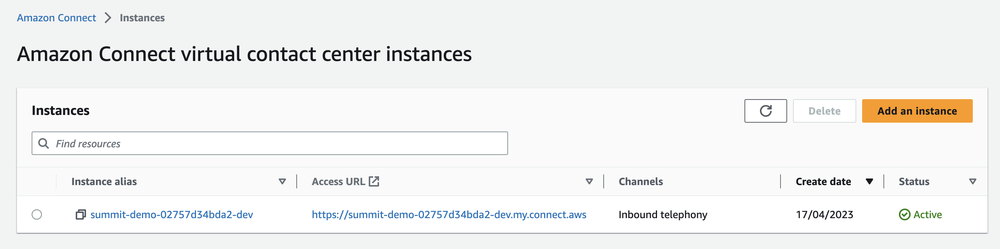

2. Choose `Data storage` and verify that `Chat transcripts` are stored in an S3 bucket encrypted with a key

    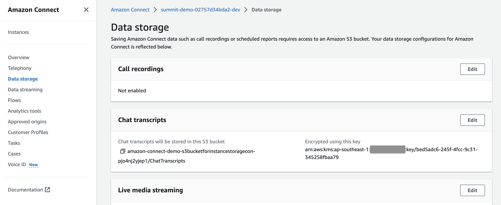

3. Navigate to the S3 console and select the S3 bucket that was created. This S3 bucket is initially empty.

    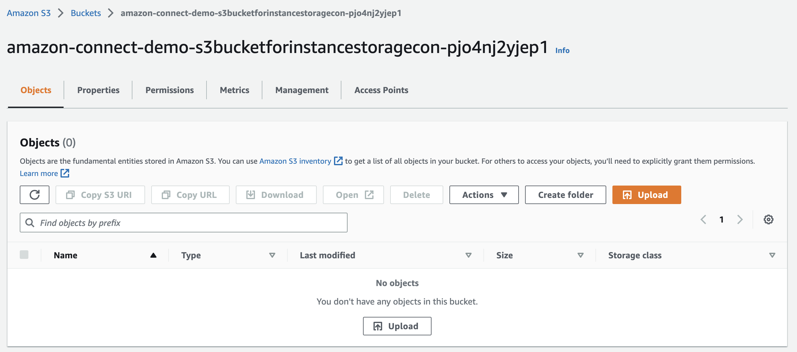

#### Test chat in Amazon Connect to produce chat transcripts

1. Retrieve the Admin credentials from Systems Manager Parameter Store. Select `amazon-connect-temp-Admin-password`

    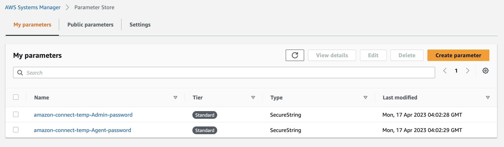

2. Choose `Show` and record the password to be used to log in to Amazon Connect.

    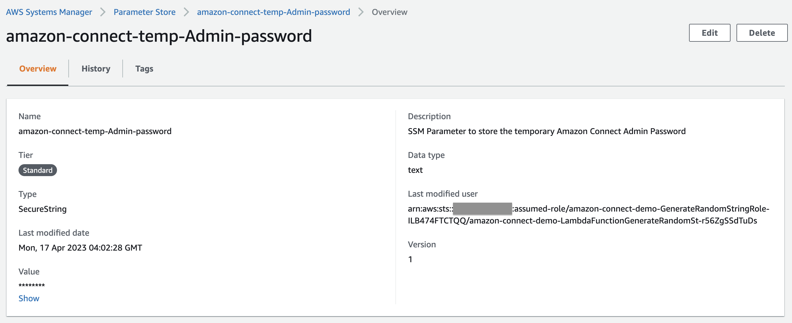

3. Navigate to the Amazon Connect console and choose the URL under `Access URL`.

    

4. For `Username`, enter `adminuser` and for password, enter the password retrieved from Step 2.

    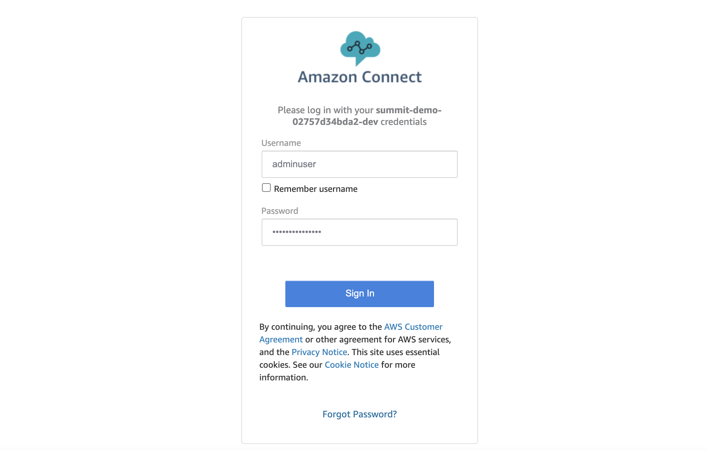

5. From the dashboard, choose `Test chat`

    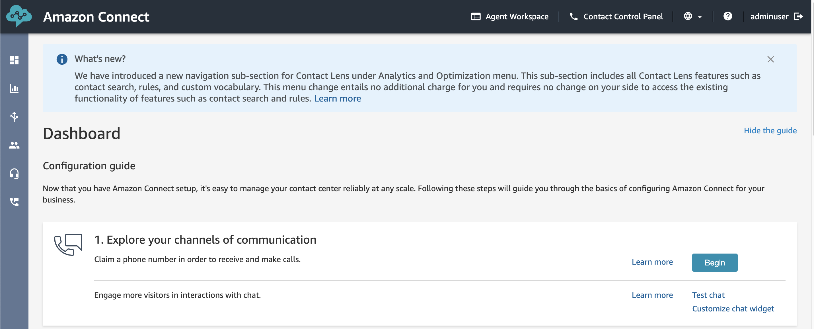

6. Choose `Test Settings`

    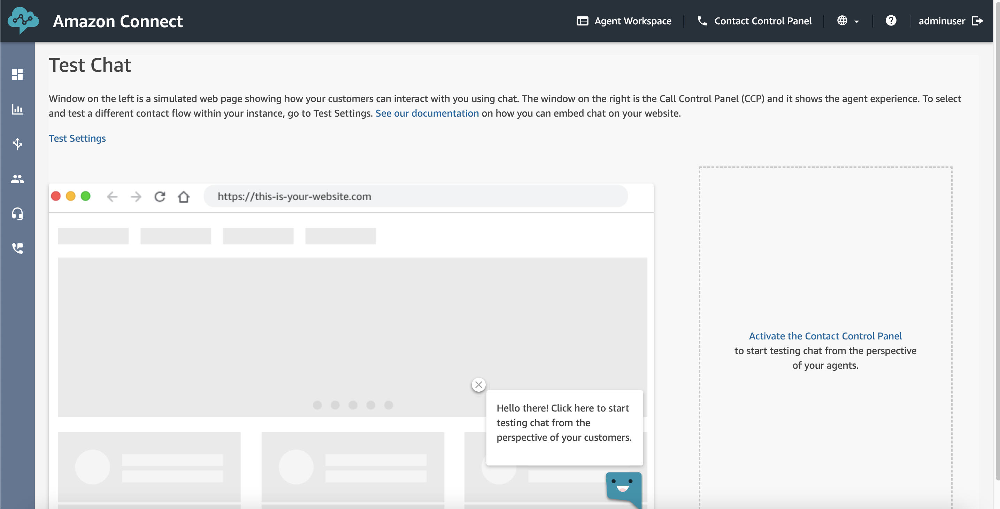

7. Choose the dropdown under `Contact Flow` and select `AnyCompany Main Flow`. Choose `Apply`

    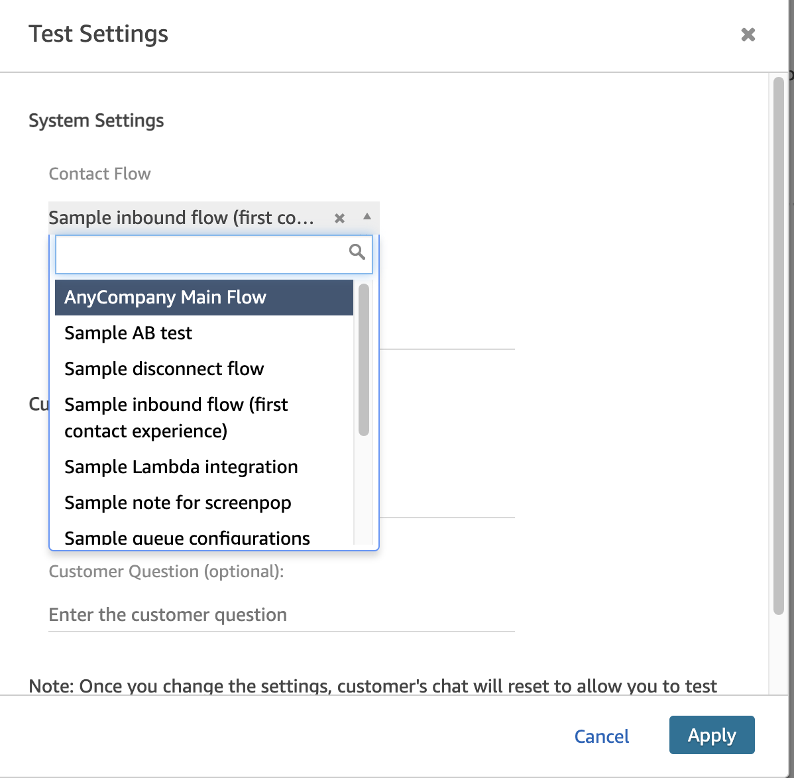

8. This opens the Test chat where we can see the greetings prompt as defined in the contact flow. Note: depending on the time the chat is initiated, you may get a different message. Choose `End chat`.

    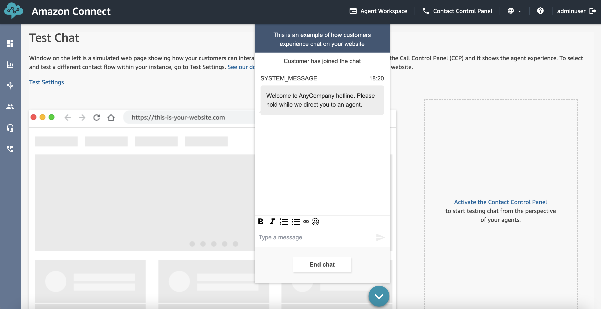

#### Verify chat transcripts are piped to the S3 bucket

1. Navigate to the S3 bucket that stores the chat transcripts. There is now a folder created called `ChatTranscripts`.

    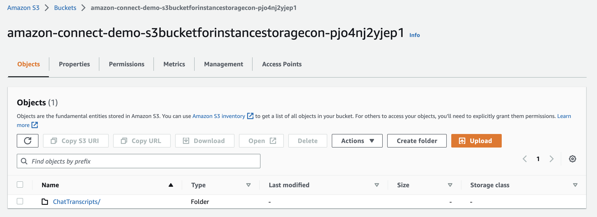

2. Choose the `ChatTranscripts` and all its sub folders until you reach a `json` object

    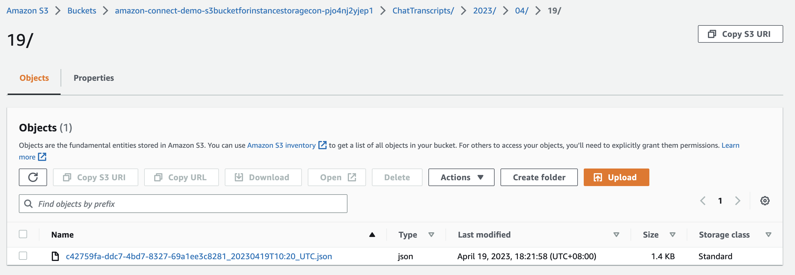

3. Select the checkbox next to the `json` object, choose the `Actions` dropdown and choose `Query with S3 Select`

    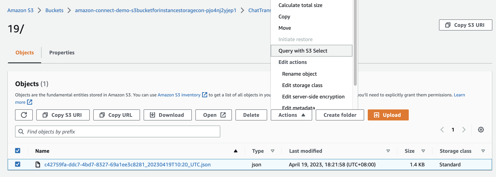

3. Scroll down to the `SQL query` section and choose `Run SQL query`

    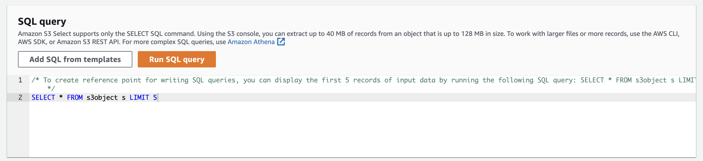

4. Scroll down again to the `Query results` section to view the transcript of the chat that we opened previously.

    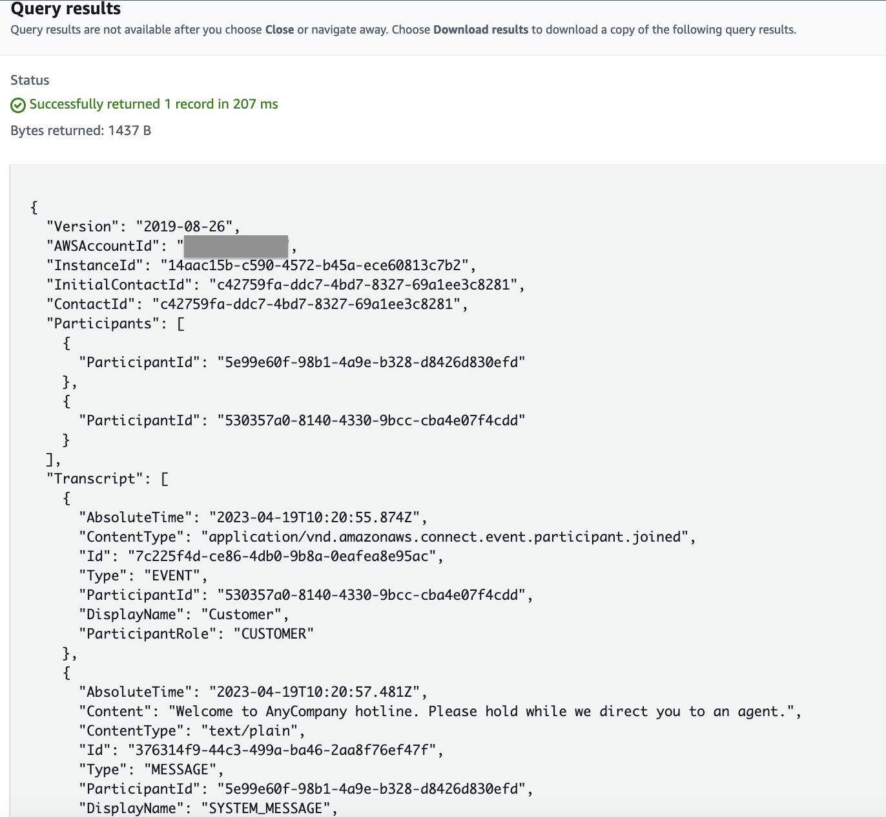

## Clean up

Once you're done, you can delete the solution by first emptying the S3 buckets for both the chat transcripts and access logs. Please refer to [Amazon Simple Storage Service: Emptying a bucket documentation](https://docs.aws.amazon.com/AmazonS3/latest/userguide/empty-bucket.html) for instructions on how to empty the S3 buckets. The S3 buckets are named as follows: `amazon-connect-demo-<S3 Bucket CloudFormation resource logical ID>-<random ID>`. For example, with the stack name as `amazon-connect-demo`, the S3 buckets are:

  * `amazon-connect-demo-s3bucketforaccesslogging-1234567890abc`
  * `amazon-connect-demo-s3bucketforinstancestoragecon-1234567890abc`

Once the S3 buckets are emptied, navigate to the [AWS CloudFormation console](https://console.aws.amazon.com/cloudformation/home?#/stacks/), selecting the stack and choosing `Delete`.

In addition, don't forget to delete the following artifacts too:

* Delete the Amazon CloudWatch Log Groups created by the Lambda Functions. They are named as follows: `/aws/lambda/<CloudFormation Stack Name>-<Lambda Function CloudFormation resource logical ID>-<random ID>`. For example, with the stack name as `amazon-connect-demo`, the CloudWatch Log groups are:

  * `/aws/lambda/amazon-connect-demo-LambdaFunctionGetRoutingProfil-1234567890ab`
  * `/aws/lambda/amazon-connect-demo-LambdaFunctionGetSecurityProfil-1234567890ab`
  * `/aws/lambda/amazon-connect-demo-LambdaFunctionGenerateRandomSt-1234567890ab`

## Security

See [CONTRIBUTING](../../../CONTRIBUTING.md#security-issue-notifications) for more information.

## License

This library is licensed under the MIT-0 License. See the LICENSE file.