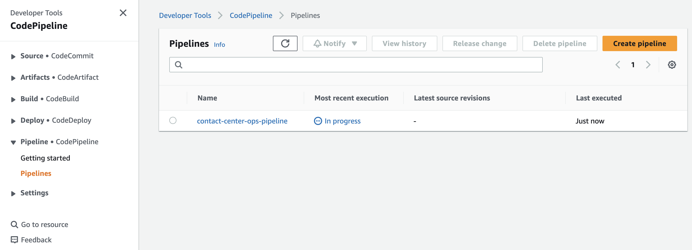

# Pipeline to deploy AWS CloudFormation across multiple environments

## Introduction

This folder provides a template to deploy resources that form a pipeline to deploy CloudFormation templates. This includes a source control service, AWS CodeCommit to store the CloudFormation templates. It also includes AWS CodePipeline to automate the continuous delivery of your infrastructure updates.

## Requirements to deploy the solution

- An AWS account to create the CloudFormation stack in.

    - In this account, ensure that the IAM principal deploying the CloudFormation template has the required permissions to create the resources in the stack.

## Cost of the solution

The resources created could incur costs in your AWS Account. Consider deleting the resources created once your tests are done. Some reference links to calculate the costs are as follows:

* For more information about AWS CodeCommit Pricing and Free Tier, please refer to the [AWS CodeCommit Pricing documentation](https://aws.amazon.com/codecommit/pricing/).
* For more information about AWS CodePipeline Pricing and Free Tier, please refer to the [AWS CodePipeline Pricing documentation](https://aws.amazon.com/codepipeline/pricing/).
* For more information about Amazon S3 Pricing and Free Tier, please refer to the [Amazon S3 Pricing documentation](https://aws.amazon.com/s3/pricing/).

## Deploying the DevOps pipeline

The [devops.yaml CloudFormation template](./devops.yaml) deploys the following architecture:


* AWS CodeCommit

  * A CodeCommit repository

* AWS CodePipeline

  * A pipeline that reads the CloudFormation template from the CodeCommit repository and deploys it to `dev` and `prod` environments. This pipeline also has a manual approval step between the transition from `dev` to `prod`.
  * The pipeline has permissions has to pass an IAM role to CloudFormation and this is used to provision the resources specified in the CloudFormation template stored in the CodeCommit repository. Change the permissions accordingly depending on the template that you are trying to deploy using this pipeline.

* Amazon S3 buckets

  * An Amazon S3 buckets to store the output artifacts from CodeCommit

### Deployment Steps

The template that deploys the pipeline can be found at [devops.yaml](./devops.yaml).

If you're using the AWS Console, follow the instructions at [AWS CloudFormation documentation: Creating a stack on the AWS CloudFormation console](https://docs.aws.amazon.com/AWSCloudFormation/latest/UserGuide/cfn-console-create-stack.html).

If you're using the AWS CLI, follow the instructions at [AWS CloudFormation documentation: Using the AWS Command Line Interface](https://docs.aws.amazon.com/AWSCloudFormation/latest/UserGuide/cfn-using-cli.html). For a sample command, run the following, replacing the parameters accordingly. You can also override additional parameters.

```bash
aws cloudformation deploy \
  --template-file ./devops.yaml \
  --stack-name contact-center-ops \
  --capabilities CAPABILITY_IAM
```

### Testing the solution

#### First deployment

1. Navigate to the CodeCommit console and select `contact-center-ops-repo`.

    

2. Scroll down to the `contact-center-ops-repo` section and choose `Create file`.

    

3. A template that you may use can be found [here](../../connect/basic-hours-of-operation-contact-flow/contact-center.yaml). This template creates a contact center with a sample contact flow hours of operation, and phone number. Copy the template and paste it here. Please refer to the [documentation](../../connect/basic-hours-of-operation-contact-flow/README.md#cost-of-the-solution) to understand the potential costs associated with deploying this template.

    

4. Scroll down and enter the following and then choose `Commit changes`

    

    - `File name`: `contact-center.yaml`
    - `Author name`: `<replace with your name>`
    - `Email address`: `<replace with your email address>`
    - `Commit message`: `first iteration of contact center`

5. Navigate to the CodePipeline console and verify that the pipeline, `contact-center-ops-pipeline` is `In progress`. If you do not see this, you may have to wait a few minutes.

    

6. Select `contact-center-ops-pipeline` and verify that the pipeline is now at the `Deploy-Dev` step which is deploying to our dev environment.

    

7. Once the deployment to dev has `Succeeded`, the pipeline pauses at the `Approval` step.

    

8. Navigate to the CloudFormation console to verify that the stack has `contact-center-dev` has been deployed.

    

9. You may follow the testing steps [here](../../connect/basic-hours-of-operation-contact-flow/README.md#testing-the-first-iteration) to validate the deployment.

10. If the deployment is valid, head back to the `Approval` step and choose `Review`

    

11. Enter some comments to approve the step.

    

12. After approval, the step transitions to `Deploy-Prod` which deploys the CloudFormation template to the production environment.

    

13. After a few minutes, verify that the deployment says `Succeeded`.

    

14. Navigate to the CloudFormation console to verify that the stack has `contact-center-prod` has been deployed.

    

15. You may follow the testing steps [here](../../connect/basic-hours-of-operation-contact-flow/README.md#testing-the-first-iteration) to validate the deployment.

#### Second deployment

1. Navigate to the CodeCommit console and select `contact-center-ops-repo`.

    

2. Select `contact-center.yaml`.

    

3. Choose `Edit`

    

4. A template that you may use can be found [here](../../connect/basic-hours-of-operation-contact-flow/contact-center-update.yaml). This template updates the hours of operation and contact flow fro the first deployment. Copy the template and paste it here. Please refer to the [documentation](../../connect/basic-hours-of-operation-contact-flow/README.md#cost-of-the-solution) to understand the potential costs associated with deploying this template.

    

4. Scroll down and enter the following and then choose `Commit changes`:

    

    - `File name`: `contact-center.yaml`
    - `Author name`: `<replace with your name>`
    - `Email address`: `<replace with your email address>`
    - `Commit message`: `second iteration of contact center`

5. Navigate to the CodePipeline console and verify that the pipeline, `contact-center-ops-pipeline` is `In progress`. If you do not see this, you may have to wait a few minutes.

    

6. Select `contact-center-ops-pipeline` and verify that the pipeline is now at the `Deploy-Dev` step which is deploying to our dev environment.

    

7. Once the deployment to dev has `Succeeded`, the pipeline pauses at the `Approval` step.

    

8. Navigate to the CloudFormation console to verify that the stack has `contact-center-dev` has been updated, with `Status` `UPDATE_COMPLETE`.

    

9. You may follow the testing steps [here](../../connect/basic-hours-of-operation-contact-flow/README.md#testing-the-second-iteration) to validate the deployment.

10. If the deployment is valid, head back to the `Approval` step and choose `Review`

    

11. Enter some comments to approve the step.

    

12. After approval, the step transitions to `Deploy-Prod` which deploys the CloudFormation template to the production environment.

    

13. After a few minutes, verify that the deployment says `Succeeded`.

    

14. Navigate to the CloudFormation console to verify that the stack has `contact-center-prod` has been updated, with `Status` `UPDATE_COMPLETE`.

    

15. You may follow the testing steps [here](../../connect/basic-hours-of-operation-contact-flow/README.md#testing-the-second-iteration) to validate the deployment.

## Clean up

Once you're done, you can delete the solution by first emptying the S3 bucket for the CodePipeline artifacts. Please refer to [Amazon Simple Storage Service: Emptying a bucket documentation](https://docs.aws.amazon.com/AmazonS3/latest/userguide/empty-bucket.html) for instructions on how to empty the S3 bucket. The S3 bucket is named as follows: `contact-center-ops-<S3 Bucket CloudFormation resource logical ID>-<random ID>`. For example, with the stack name as `contact-center-ops`, the S3 bucket is:

  * `contact-center-ops-artifactstorebucket-1234567890abc`

Once the S3 buckets are emptied, delete the resources created by navigating to the [AWS CloudFormation console](https://console.aws.amazon.com/cloudformation/home?#/stacks/), selecting the stack and choosing `Delete`.

## Security

See [CONTRIBUTING](../../../CONTRIBUTING.md#security-issue-notifications) for more information.

## License

This library is licensed under the MIT-0 License. See the LICENSE file.